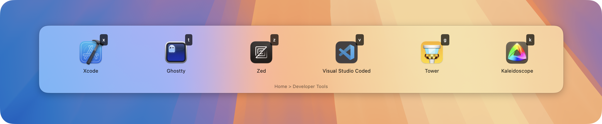

[](https://github.com/amebalabs/SwiftKey/blob/master/LICENSE)
[](https://github.com/amebalabs/SwiftKey/releases/latest)

<p align="center">
    <a href="https://swiftkey.app"></a>
    <h1 align="center"><code style="text-shadow: 0px 3px 10px rgba(8, 0, 6, 0.35); font-size: 3rem; font-family: ui-monospace, Menlo, monospace; font-weight: 800; background: transparent; color: #4d3e56; padding: 0.2rem 0.2rem; border-radius: 6px">SwiftKey</code></h1>
    <h4 align="center" style="padding: 0; margin: 0; font-family: ui-monospace, monospace;">Hackable Launcher</h4>
    <h6 align="center" style="padding: 0; margin: 0; font-family: ui-monospace, monospace; font-weight: 400;">Right at your fingertips</h6>
</p>

<p align="center">
    <a href="https://swiftkey.app"></a>
</p>

## Overview

SwiftKey is a powerful macOS productivity tool that provides quick access to applications, shortcuts, and custom actions through customizable keyboard shortcuts and an elegant overlay interface.

### Installation

- Download the app from the [Releases](https://github.com/amebalabs/SwiftKey/releases/latest) and drag it to your `Applications` folder
- ...or install with Homebrew:
```bash
 brew tap melonamin/formulae
 brew install swiftkey
```

## Features
- 🎯 Multiple overlay styles:
  - Panel mode with horizontal/vertical layouts
  - HUD mode for a compact interface
  - Menu bar mode for minimal interference
- ⌨️ Fully keyboard-driven interface
- 🔧 YAML-based configuration
- 🔄 Dynamic menu generation
- 🚀 Support for various action types:
  - Launch applications
  - Open URLs
  - Run shell commands
  - Execute Apple Shortcuts
- 🎨 SF Symbols integration for menu icons
- 🔍 Deep linking support
- 📦 Automatic updates with beta channel support

## Installation
1. Download the latest release from the Releases page
2. Move SwiftKey.app to your Applications folder
3. Launch SwiftKey and follow the onboarding process

## Configuration
SwiftKey uses YAML for configuration. Here's a comprehensive set of examples demonstrating all available options and common use cases:

### Basic Configuration

```yaml
# Simplest example - just key, title, and action
- key: "c"
  title: "Launch Calculator"
  action: "launch:///System/Applications/Calculator.app"

# With custom icon (from SF Symbols)
- key: "n"
  icon: "note.text"
  title: "Launch Notes"
  action: "launch:///System/Applications/Notes.app"
```

### Submenu Examples

```yaml
# Basic submenu
- key: "b"
  icon: "bookmark.fill"
  title: "Bookmarks"
  submenu:
    - key: "t"
      title: "TechCrunch"
      action: "open://https://techcrunch.com"
    - key: "v"
      title: "The Verge"
      action: "open://https://www.theverge.com"

# Nested submenus
- key: "d"
  icon: "folder.fill"
  title: "Development"
  submenu:
    - key: "e"
      title: "Editors"
      submenu:
        - key: "v"
          title: "VS Code"
          action: "launch:///Applications/Visual Studio Code.app"
        - key: "x"
          title: "Xcode"
          action: "launch:///Applications/Xcode.app"
    - key: "t"
      title: "Terminal"
      action: "launch:///System/Applications/Terminal.app"
```

### Batch Mode

```yaml
# Batch mode - all items in submenu will execute when selecting this item
# Using batch: true flag
- key: "s"
  icon: "bolt.fill"
  title: "Start Workflow"
  batch: true  # Execute all submenu items at once
  submenu:
    - key: "1"
      title: "Open Mail"
      action: "launch:///System/Applications/Mail.app"
    - key: "2"
      title: "Open Calendar"
      action: "launch:///System/Applications/Calendar.app"
    - key: "3"
      title: "Open Slack"
      action: "launch:///Applications/Slack.app"

# Alternative: Press and hold Option (⌥) key when selecting any submenu
# to execute all items in batch mode
```

### Sticky Items

```yaml
# Sticky items - UI stays open after execution
- key: "v"
  icon: "volume.3.fill"
  title: "Volume Up"
  action: "shell://osascript -e 'set volume output volume (output volume of (get volume settings) + 10)'"
  sticky: true  # UI stays open after executing this action

- key: "m"
  icon: "volume.fill"
  title: "Mute Toggle"
  action: "shell://osascript -e 'set volume output muted (not output muted of (get volume settings))'"
  sticky: true

# Alternative: Press and hold Option (⌥) key when selecting any item
# to invert its sticky behavior (non-sticky items become sticky and vice versa)
```


### Notifications

```yaml
# Show notification after execution
- key: "r"
  icon: "text.append"
  title: "Run Script"
  action: "shell://~/scripts/update_database.sh"
  notify: true  # Show notification when script completes
```

### Hidden Items

```yaml
# Hidden items - not shown in UI but can be activated with key or hotkey
- key: "h"
  title: "Hidden Action"
  action: "shell://say 'Secret action activated'"
  hidden: true
  hotkey: "cmd+shift+h"

# Single hidden item in submenu will still be shown despite being hidden
- key: "s"
  title: "Special Menu"
  submenu:
    - key: "x"
      title: "Only Item (Hidden but Still Shown)"
      action: "shell://say 'I am shown because I am the only item in this submenu'"
      hidden: true
```

### Dynamic Menus

```yaml
# Dynamic menu - content generated by a script
- key: "p"
  icon: "terminal"
  title: "Running Processes"
  action: "dynamic://dynamic_menu.sh"
```

### Global Hotkeys

```yaml
# Global hotkey for direct action
- key: "c"
  title: "Launch Calculator"
  action: "launch:///Applications/Calculator.app"
  hotkey: "cmd+ctrl+c"  # Global shortcut: Cmd+Ctrl+C

# Global hotkey to open specific submenu
- key: "d"
  title: "Development Tools"
  hotkey: "cmd+shift+d"  # Global shortcut: Cmd+Shift+D
  submenu:
    - key: "1"
      title: "VS Code"
      action: "launch:///Applications/Visual Studio Code.app"
    - key: "2"
      title: "Terminal"
      action: "launch:///System/Applications/Terminal.app"
```

### Practical Use Cases

```yaml
# Developer Workflow
- key: "d"
  icon: "hammer.fill"
  title: "Developer Tools"
  submenu:
    - key: "c"
      title: "VS Code"
      action: "launch:///Applications/Visual Studio Code.app"
    - key: "g"
      title: "Git Operations"
      submenu:
        - key: "s"
          title: "Git Status"
          action: "shell://'cd ~/projects/current && git status'"
          notify: true
        - key: "p"
          title: "Git Pull"
          action: "shell://'cd ~/projects/current && git pull'"
          notify: true
    - key: "b"
      title: "Build Project"
      action: "shell://'cd ~/projects/current && make build'"
      notify: true
    - key: "t"
      title: "Run Tests"
      action: "shell://'cd ~/projects/current && make test'"
      notify: true

# System Administration
- key: "s"
  icon: "gear"
  title: "System Tools"
  submenu:
    - key: "d"
      title: "Show Disk Usage"
      action: "shell://'df -h | grep /dev/disk1s1'"
      sticky: true
      notify: true
    - key: "m"
      title: "Show Memory Usage"
      action: "shell://'top -l 1 | grep PhysMem'"
      sticky: true
      notify: true
    - key: "n"
      title: "Network Tools"
      submenu:
        - key: "i"
          title: "External IP"
          action: "shell://'curl -s ifconfig.me'"
          sticky: true
          notify: true
        - key: "p"
          title: "Ping Google"
          action: "shell://'ping -c 4 google.com'"
          sticky: true
          notify: true
    - key: "r"
      title: "Restart Services"
      batch: true
      submenu:
        - key: "1"
          title: "Restart DNS"
          action: "shell://'sudo killall -HUP mDNSResponder'"
          notify: true
        - key: "2"
          title: "Flush DNS Cache"
          action: "shell://'sudo dscacheutil -flushcache'"
          notify: true

# Quick Actions
- key: "q"
  icon: "bolt.fill"
  title: "Quick Actions"
  submenu:
    - key: "e"
      title: "Empty Trash"
      action: "shell://'osascript -e \"tell application Finder to empty trash\"'"
      notify: true
    - key: "c"
      title: "Copy SSH Key"
      action: "shell://'pbcopy < ~/.ssh/id_rsa.pub && echo \"SSH key copied to clipboard\"'"
      notify: true
    - key: "s"
      title: "Take Screenshot"
      action: "shell://'screencapture -i ~/Desktop/screenshot-$(date +%Y%m%d-%H%M%S).png'"
      notify: true
```

## Action Types
- `launch://` — Launch applications
- `open://` — Open URLs
- `shell://` — Execute shell commands
- `shortcut://` — Run Apple Shortcuts
- `dynamic://` — Generate dynamic menus

## Menu Item Properties
- `key` — Single character trigger key
- `icon` — SF Symbol name or omit for automatic icons
- `title` — Display title
- `action` — Action to execute
- `sticky` — Keep overlay open after execution (optional). Alternative: hold ⌥ (Option) key to invert the sticky behavior.
- `notify` — Show notification after execution (optional)
- `batch` — Execute all submenu items (optional). Alternative: hold ⌥ (Option) key for batch execution.
- `hidden` — Item is not shown in UI but can be triggered by key or hotkey (optional, defaults to false). Note: If a submenu contains only a single hidden item, it will still be shown.
- `submenu` — Nested menu items (optional)
- `hotkey` — Global keyboard shortcut (optional)

## Hotkey Formats
SwiftKey allows you to assign global hotkeys to menu items. Hotkeys work even when the overlay is not visible.

Supported hotkey formats:
- Modifiers: `cmd`, `ctrl`, `alt`, `shift`
- Keys: letters, numbers, function keys (f1-f12), arrows, and special keys
- Examples:
  - `cmd+shift+a`
  - `ctrl+alt+p`
  - `cmd+f12`
  - `shift+space`

Hotkeys can:
1. Execute actions directly — work globally without showing the overlay
2. Open specific submenus

## Deep Linking
SwiftKey supports deep linking through the swiftkey:// URL scheme:
```swiftkey://open?path=a,b,c```

This opens the menu and navigates through the specified path.

## License

This project is licensed under the MIT License - see the LICENSE file for details.
