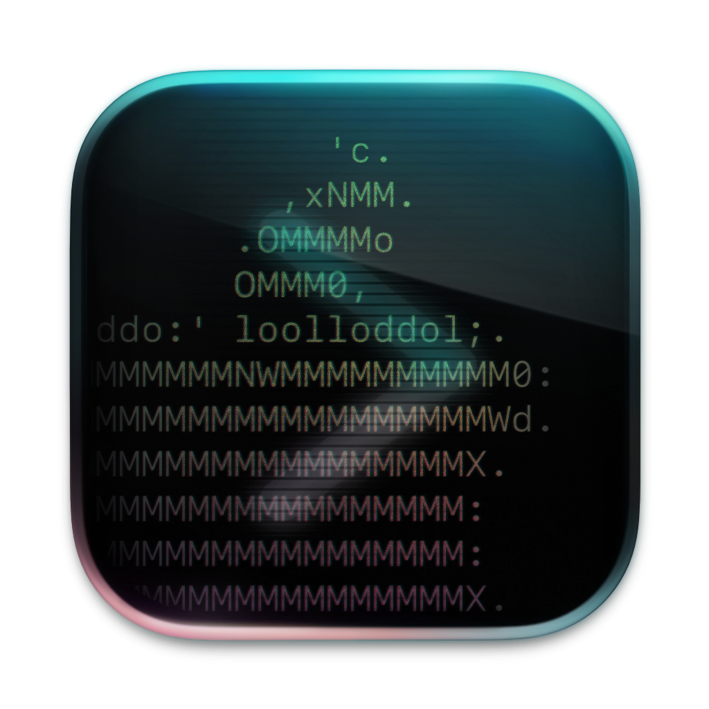

[](https://github.com/amebalabs/SwiftKey/blob/master/LICENSE)
[](https://github.com/amebalabs/SwiftKey/releases/latest)

<p align="center">
 
</p>

# SwiftKey

SwiftKey is a powerful macOS productivity tool that provides quick access to applications, shortcuts, and custom actions through customizable keyboard shortcuts and an elegant overlay interface.

**TL;DR:** A highly customizable keyboard-driven launcher for macOS with multiple interface styles and YAML configuration.

## Features
- 🎯 Multiple overlay styles:
  - Panel mode with horizontal/vertical layouts
  - HUD mode for a compact interface
  - Menu bar mode for minimal interference
- ⌨️ Fully keyboard-driven interface
- 🔧 YAML-based configuration
- 🔄 Dynamic menu generation
- 🚀 Support for various action types:
  - Launch applications
  - Open URLs
  - Run shell commands
  - Execute Apple Shortcuts
- 🎨 SF Symbols integration for menu icons
- 🔍 Deep linking support
- 📦 Automatic updates with beta channel support

## Installation
1. Download the latest release from the Releases page
2. Move SwiftKey.app to your Applications folder
3. Launch SwiftKey and follow the onboarding process

## Configuration
SwiftKey uses YAML for configuration. Here's a basic example:

```yaml
- key: "c"
  title: "Launch Notes"
  action: "launch:///System/Applications/Notes.app"

- key: "b"
  icon: "bookmark.fill"
  title: "Bookmarks"
  batch: true
  submenu:
    - key: "t"
      title: "TechCrunch"
      action: "open://https://techcrunch.com"
    - key: "v"
      title: "The Verge"
      action: "open://https://www.theverge.com"
    - key: "w"
      title: "Wired"
      action: "open://https://www.wired.com"
    - key: "a"
      title: "Ars Technica"
      action: "open://https://arstechnica.com"
    - key: "e"
      title: "Engadget"
      action: "open://https://www.engadget.com"
```

## Action Types
- `launch://` — Launch applications
- `open://` — Open URLs
- `shell://` — Execute shell commands
- `shortcut://` — Run Apple Shortcuts
- `dynamic://` — Generate dynamic menus

## Menu Item Properties
- `key` — Single character trigger key
- `icon` — SF Symbol name or omit for automatic icons
- `title` — Display title
- `action` — Action to execute
- `stick` — Keep overlay open after execution (optional)
- `notify` — Show notification after execution (optional)
- `batch` — Execute all submenu items (optional). Alternative: hold ⌥ for batch execution.
- `submenu` — Nested menu items (optional)

## Deep Linking
SwiftKey supports deep linking through the swiftkey:// URL scheme:
```swiftkey://open?path=a,b,c```

This opens the menu and navigates through the specified path.

## License

This project is licensed under the MIT License - see the LICENSE file for details.
